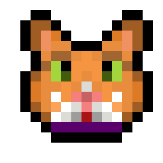
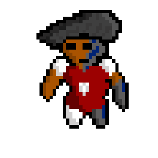
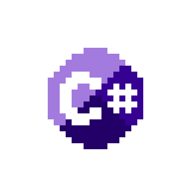
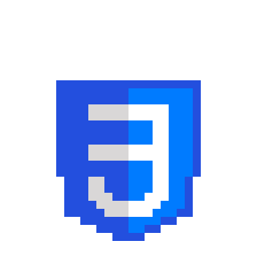

# 30 dias de pixelart

## Dia 1 (13/08/2025)

    
Bananananana (64x64)
 
    

## Dia 2 (14/08/2025)

    
VS Code (64x64)
 
    
    
    <!--  -->

## Dia 3 (15/08/2025)

    
Gato??? (16x16)
 
    
    

    
Cara meio robô bizarro que surgiu de uns rabiscos aleatórios (48x48)
 
    

## Dia 4 (18/08/2025)

    
Csharp (32x32)
 
    

## Dia 5 (19/08/2025)

    
HTML e CSS (32x32)
 
    
    

